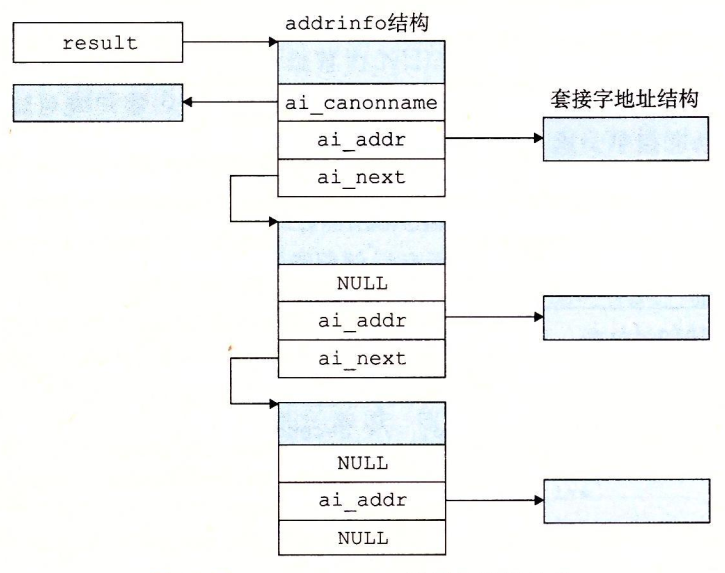

# 理解 Tiny Web Server

## 套接字

Internet 中，客户端和服务器通过在连接上发送和接收字节流来通信。所谓*套接字*就是网络连接的端点，每个套接字都有相应的套接字地址。套接字由一个 Internet 地址和一个 16 位的整数端口组成，可用“地址:端口”表示。因此，一个连接可以用两端的套接字地址唯一确定：`(cliaddr:cliport, servaddr:servport)`

在客户端，套接字端口通常由内核自动分配，称为临时端口。然而，服务段的某些知名端口确有其特殊的含义，其提供的服务也通常与端口相对应。文件 `/etc/services/` 中包含了机器提供的端口与服务的映射关系。


| 端口 | 服务 |
| --- | --- |
| 21 | 文件传输协议 FTP |
| 25 | 电子邮件服务 SMTP |
| 80 | Web 服务 HTTP |

## 套接字数据结构

套接字接口是一组函数，与 Unix I/O函数相结合，可以创建出网络应用。当然，Windows、Mac等操作系统也有自己的套接字接口。但我主要以类Unix操作系统为例。

在Linux内核中，套接字被看作一个有相应描述符的文件。这也是 Linux 系统中“一切皆文件”的思想体现。套接字地址在**网络应用**中，用如下数据结构表示。`sin_family` 描述协议族，对应Internet一直是 `AF_INET`，`sin_port` 是一个 16 位的端口号，而 `sin_addr` 就是 32 位的 IPv4 地址。它们**总是以网络字节顺序存放的**。

```c
struct sockaddr_in {
    uint16_t        sin_family;
    uint16_t        sin_port;
    struct in_addr  sin_addr;
    unsigned char   sin_zero[8];
}
```

而在编程中，`connect`、`bind`和`accept`函数要求一个指向与协议相关的套接字地址结构的指针。为此，设计者定义了对套接字函数都通用的 `sockaddr` 数据结构。

```c
struct sockaddr {
    uint16_t    sa_family;      /* Protocol family */
    char        sa_data[14];    /* Address data */
}

typedef struct sockaddr SA;
```

## 套接字接口

### 1、socket 函数

客户端和服务器使用 `socket` 函数创建套接字描述符。

```c
#include <sys/types.h>
#include <sys/socket.h>

int socket(int domain, int type, int protocol);

/** 创建套接字，成为一个连接端点，就用如下硬编码调用 socket 函数 **/
clientfd = socket(AF_INET, SOCK_STREAM, 0);
```

其中，`AF_INET` 表示 32 位 IPv4 地址，而 `SOCK_STREAM` 表示套接字是连接的端点。但这条代码只能适用于使用 IPv4 协议的应用，对于 IPv6，就要改为 `AF_INET6`。之后我们会了解到协议无关的书写方法。

### 2、connect 函数

客户端通过 `connect` 函数建立与服务器的连接。其中服务器的套接字地址为 `addr`，而其字节长度为 `addrlen`。

```c
#include <sys/socket.h>

int connect(int clientfd, const struct sockaddr *addr, socklen_t addrlen);
```

`connect` 函数会一直阻塞，直到连接成功或者发生错误。连接成功后，`clientfd` 描述符就可以读写了。

### 3、bind 函数

服务器用 `bind` 等函数与客户端建立连接。`bind` 函数将服务器套接字地址和服务器的套接字描述符相绑定。便于之后的监听、接收等操作。

```c
#include <sys/socket.h>

int bind(int sockfd, const struct sockaddr *addr, socklen_t addrlen);
```

### 4、listen 函数

客户端发起连接请求后，服务器会等待来自客户端的连接请求。此时服务器需要调用 `listen` 函数将套接字转为监听套接字。`backlog` 参数暗示内核中可以容忍排队等待未完成的连接请求的最大数量。

```c
#include <sys/socket.h>

int listen(int sockfd, int backlog);
```

### 5、accept 函数

之后，服务器通过调用 `accept` 函数来等待客户端的连接请求。`accept` 函数等待来自客户端的连接请求，并在 `addr` 中填入客户端的套接字地址，最后返回一个已连接的套接字描述符。

```c
#include <sys/socket.h>

int accept(int listenfd, struct sockaddr *addr, int *addrlen);
```

## 协议无关方法

Linux 提供了很多强大的函数，实现了**二进制套接字地址结构**和**主机名、主机地址、服务名和端口号的字符串表示**之间的相互转化。若和套接字一起使用，就可以开发出独立于协议的网络程序。

### 0、数据结构

在开始介绍各个函数之前，需要了解表示二进制套接字地址结构等信息的数据结构 `addrinfo`。因为接下来介绍的函数都与它密切相关。

```c
struct addrinfo {
    int         ai_flags;
    int         ai_family;
    int         ai_socktype;
    int         ai_protocol;
    char        *ai_cannonname;
    size_t      ai_addrlen;
    struct sockaddr *ai_addr;
    struct addrinfo *ai_next;
}
```

`addrinfo` 结构中的字段是不透明的，他可以直接传递给套接字接口中的函数。`ai_family`、`ai_socktype` 和 `ai_protocol` 分别表示协议族、套接字类型，直接传递给 `socket` 函数做参数 。类似地，`ai_addr` 和 `ai_addrlen` 可直接传递给 `connect` 和 `bind` 函数。封装完成后，编写客户端、服务端程序就无需关注于某一个 IP 协议，只要流程一致即可。

另外，`ai_next` 指向列表中下一个 `addrinfo` 结构，该字段方便函数遍历查找。而 `ai_flags` 是一个位掩码，具体内容可参考 [Linux Manual Page](https://man7.org/linux/man-pages/man3/getaddrinfo.3.html)。

### 1、getaddrinfo 函数

`getaddrinfo` 函数将主机名、主机地址、服务名和端口号的字符串表示转化为二进制套接字结构。作为 `gethostbyname` 和 `getservbyname` 函数的替代品，它是可重入的，适用于任何协议。

```c
#include <sys/types.h>
#include <sys/socket.h>

int getaddrinfo(const char *host, const char *service, const struct addrinfo *hints, struct addrinfo **result);

void freeaddrinfo(struct addrinfo *result);

const char *gai_strerror(int errcode);
```

`host` 和 `service` 是两个给出的套接字地址。`host` 可以是域名，点分十进制 IP 地址，`service` 可以是服务名，也可以是端口号。`hints` 是一个可选参数，它可以更好地控制函数返回的套接字地址列表。`getaddrinfo` 返回了一个指向 `addrinfo` 结构的链表的指针 `result`。其中每个结构指向一个对应于 `host` 和 `service` 的套接字地址结构，如下图。



客户端调用后，会遍历该列表，依次尝试每个套接字地址，直到调用 `socket` 和 `connect` 成功。而服务器调用时，也会依次尝试套接字地址，直到 `socket` 和 `bind` 成功。

`freeaddrinfo` 函数用以释放该链表，而若出错，调用 `gai_strerror` 函数可将错误代码转为字符串。

### 2、getnameinfo 函数

`getnameinfo` 函数与 `getaddrinfo` 函数相反，它将一个套接字地址结构转换为相应的主机和服务名字符串。它是已弃用的 `gethostbyaddr` 和 `getservbyport` 的替代函数，它是可重入，也是协议无关的。

```c
#include <sys/socket.h>
#include <netdb.h>

int getnameinfo(const struct sockaddr *sa, socklen_t salen, char *host, size_t hostlen, char *service, size_t servlen, int flags); 
```

参数 `sa` 指向大小为 `salen` 的套接字地址结构，`host` 指向大小为 `hostlen` 的对应主机的字符串，`service` 指向大小为 `servlen` 的对应服务名字符串。而参数 `flags` 是一个位掩码，能够修改默认行为。同样地，错误代码处理由 `gai_strerror` 负责。

如果不想要主机名，可以设置为 `NULL`，`hostlen` 设置为 0，同理可用在服务名，但两者不能全为 `NULL` 。

## HTTP 事务

Web 客户端和服务器之间的交互，需要用到 HTTP（超文本传输协议）。Web 客户端打开一个到服务器的 Internet 连接，并且请求某些内容时，服务器会响应该请求，并将内容发给客户端，最终内容被显示在屏幕上。Web 内容可用 HTML 语言来编写，告诉浏览器如何编排网页内容。

HTTP 事务有两种，请求和响应。在 Linux 中，使用 `telnet` 程序访问某一网站，就可得到 HTTP 事务的基本格式，大家不妨在自己的 Linux 环境中测试一下。

一个 HTTP 请求的组成：一个*请求行*，后面跟随零个或多个*请求报头*，再跟随一个空的文本行作终止报头。请求行的格式是：*method URI version*。HTTP 支持许多不同方法，包括GET、POST、OPTIONS、HEAD、PUT、DELETE 和 TRACE。大多数 HTTP 请求都是 GET 方法。而所谓的 URI 则是 URL 的后缀，描述请求的文件名以及相应参数。version 则是该请求遵循的 HTTP 版本，最新版本是 HTTP/1.1 。

请求报头为服务器提供了额外的信息，比如浏览器名、MIME 类型，请求报头的格式为：*header-name: header-data*。比如：

```
MIME-Version: 1.0
Date: Mon, 8 Jan 2010
Content-Type: text/html
```

随后，有一行空文本行终止报头，并跟随着相应的 HTML 文件。

HTTP 响应的组成是一个响应行，后面跟随着零个或更多的响应报头，再跟随一个终止报头的空行和响应主体。响应行的格式是：*version startus-code status-message*。常见的状态码如下：

| 状态代码 | 状态消息 | 描述 |
| --- | --- | --- |
| 200 | 成功 | 处理请求无误 |
| 301 | 永久移动 | 内容已移动到 location 头中指明的主机上 |
| 400 | 错误请求 | 服务器不能理解请求 |
| 403 | 禁止 | 服务器无权访问所请求的文件 |
| 404 | 未发现 | 服务器不能找到所请求的文件 |
| 501 | 未实现 | 服务器不支持请求的方法 |
| 505 | HTTP 版本不支持 | 服务器不支持请求的版本 |
